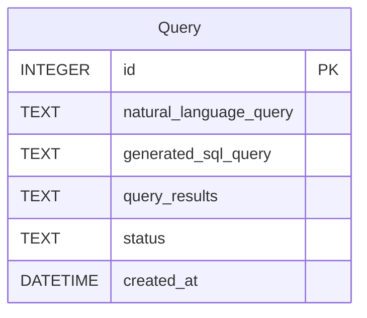

# Database Design: Data Analyst / Query Bot Prototype

## 1. Database Design Summary

This database design focuses on supporting the core functionality of the Data Analyst / Query Bot prototype using **SQLite and SQLModel**. The primary goal is to store information related to user queries and potentially metadata about connected databases. The design is kept simple for the initial prototype scope.

## 2. Key Entities and Relationships

For the initial prototype, the primary entity will be `Query`.

-   **Query:** Represents a natural language query submitted by a user and its corresponding SQL translation and results.

Relationships are not complex in this initial design, as `Query` is a standalone entity. If user authentication were added, a `User` entity would be introduced with a one-to-many relationship to `Query`.

## 3. ER Diagram (Optional but Recommended)



## 4. SQLModel Schema (Python/SQLite)

```python
from typing import Optional
from datetime import datetime
from sqlmodel import Field, SQLModel

class Query(SQLModel, table=True):
    id: Optional[int] = Field(default=None, primary_key=True)
    natural_language_query: str
    generated_sql_query: Optional[str] = None
    query_results: Optional[str] = None
    status: str = "Pending" # e.g., Pending, Translating, Executing, Completed, Failed
    created_at: datetime = Field(default_factory=datetime.utcnow)

# Note: For a real application, you would likely add relationships
# if you had a User model, e.g., user_id: Optional[int] = Field(default=None, foreign_key="user.id")
```

## 5. Prisma Schema (Node.js - Secondary)

```prisma
// This is a simplified Prisma schema for potential future Node.js compatibility.
// It mirrors the SQLModel structure but uses Prisma syntax.

generator client {
  provider = "prisma-client-js"
}

datasource db {
  provider = "sqlite" // Or "postgresql" for the final application
  url      = env("DATABASE_URL")
}

model Query {
  id                      Int       @id @default(autoincrement())
  naturalLanguageQuery    String    @map("natural_language_query")
  generatedSqlQuery       String?   @map("generated_sql_query")
  queryResults            String?   @map("query_results")
  status                  String    @default("Pending")
  createdAt               DateTime  @default(now()) @map("created_at")

  @@map("query") // Map model name to table name
}

// Note: If adding a User model and relationship:
// model User {
//   id    Int     @id @default(autoincrement())
//   email String  @unique
//   name  String?
//   queries Query[]
// }

// model Query {
//   ...
//   userId Int?
//   user   User? @relation(fields: [userId], references: [id])
//   ...
// }
```

## 6. Design Rationale & Assumptions

-   **Initial Prototype Scope:** The schema is designed to be minimal, supporting only the core query processing flow for the prototype.
-   **SQLite Choice:** SQLite is used for simplicity in the prototype, suitable for a single-file database and easy setup.
-   **SQLModel:** Chosen as the ORM for Python, providing a convenient way to define models that are both Pydantic models and SQLAlchemy models.
-   **Prisma Schema:** Included as a secondary consideration to show how the schema could be represented for a potential future Node.js backend, noting the differences in syntax and naming conventions (`naturalLanguageQuery` vs `natural_language_query`).
-   **Indexing:** For this simple prototype with a single table, explicit indexing is not strictly necessary for performance with SQLite. For a larger database or different provider (like PostgreSQL), indexing on frequently queried columns (e.g., `created_at` or potentially `status`) would be important.
-   **Assumptions:** Assumes that the query results can be stored as a string (e.g., JSON or formatted text). Assumes a single-user context for the prototype unless authentication is added.
